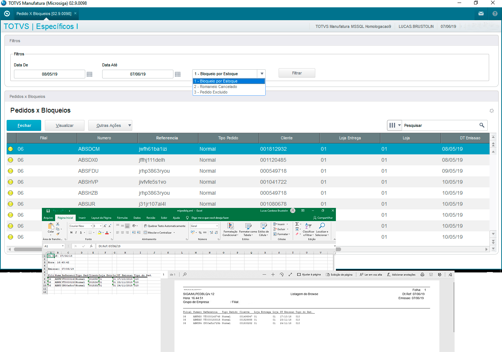

# Tela de consulta Pedidos x Bloqueios 

Browse construído  com base em uma tabela temporária permitindo a visualização de pedidos de venda, cuja o status se encontra bloqueado por falta de estoque, romaneio cancelado (tabela customizada) ou excluído pelo usuário.





# Características 

- [x] Faz a carga dos dados através de uma consulta SQL.  
- [x] Execução de filtros enquanto o browse se encontra ativo.
- [x] Como funcionalidade padrão o browser permite apresentação dos dados em formato de relatório e Excel.  
- [x] Faz a chamada da tela padrão do pedido de venda.
- [x] Permite a busca por registros deletados na base dados.
- [x] Permite a visualização da tela de legenda.
- [x] Diversos exemplos que podem ser utlizados como base.


# Como utilizar?

```
1. Compilar os fontes do diretório /src 
2. Rodar o update U_UPDBrowse() *** Este prw estará disponivel na próxima atualização "upload".
```


## Tecnologias

Projeto desenvolvido em:

- [Advpl](https://tdn.totvs.com/display/tec/AdvPL)

